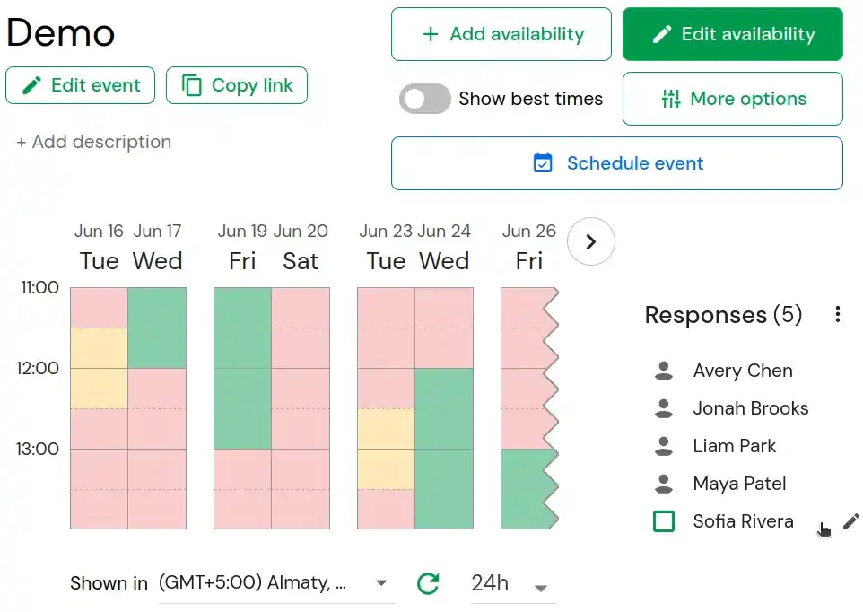

 

Timeful is a scheduling platform that helps you find the best time for a group to meet.
It is a free availability poll that is easy to use and integrates with your calendar.

Original implementation: <https://github.com/schej-it/timeful.app>

<!-- Hosted version of the site: <https://timeful.fun> -->

Built with [Vue 3](https://github.com/vuejs/core), [PostgreSQL](https://www.postgresql.org/), [Go](https://github.com/golang/go), and [TailwindCSS](https://github.com/tailwindlabs/tailwindcss)

## Demo

## Features

- [x] See when everybody's availability overlaps
- [x] Easily specify date + time ranges to meet between
- [x] "Available" vs. "If needed" times
- [x] Determine when a subset of people are available
- [x] Schedule across different time zones
- [x] Schedule an event on Timeful or in a calendar service (Google calendar, Outlook, or Apple calendar)
- [x] Export availability as CSV (desktop only)
- [ ] Only show responses to event creator
- [ ] Email notifications + reminders
- [ ] Duplicating polls
- [ ] Availability groups - stay up to date with people's real-time calendar availability

## Plugin API

Read these docs to design your own browser plugins to get + set availability on Timeful events programmatically!

[Plugin API Docs](./PLUGIN_API_README.md)

## Self-hosting

See the [Deployment Guide](./DEPLOYMENT.md) for Docker Compose and NixOS setup instructions.

See [docs/environments.md](./docs/environments.md) for development, isolated test, staging, and production environment setup.
